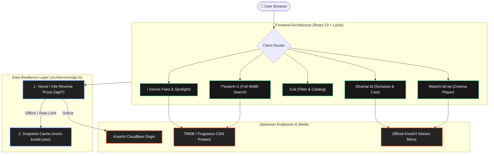

<p align="center">
  
</p>

<h1 align="center">KissKH — Asian Dramas &amp; Movies Experience</h1>

<p align="center">
  <em>A 1:1 pixel-accurate, ultra-low latency Asian drama &amp; movie streaming frontend clone of <a href="https://kisskh.do">kisskh.do</a>, powered by React 19, TypeScript, Tailwind CSS, Lenis kinetic scrolling, and dual-layer API resilience.</em>
</p>

<p align="center">
  <a href="https://kisskh-por-clone.vercel.app"></a>
  
  
  
  
</p>

<p align="center">
  
</p>

---

## ⚡ Quick Start

Experience the application locally in under 10 seconds:

```bash
# Clone the repository
git clone https://github.com/christpor/kisskh-por-clone.git
cd kisskh-por-clone

# Install dependencies using Bun
bun install

# Launch Vite development server
bun run dev
```

Visit [`http://localhost:5173`](http://localhost:5173) in your browser.

---

## 🎯 Architecture & Cognitive Flow



---

## 💎 Signature Features

1. **Exact 1:1 Screenshot Parity**:
   - **Header**: Authentic SVG logo (`long_icon.svg` with orange pill badge), navigation tabs (`Home`, `FAQ`, `Request Drama`, `Theme`, `Explore`, `Search`, `Sign in`).
   - **16:9 Hero Slider**: Auto-advancing spotlight banner with green navigation arrows (`#69f0ae`), pagination dots, top-left title tag, and floating top-right search badge.
   - **Continue Watching**: Prompt with sign-in trigger and persistent `localStorage` session.
   - **Curated Rails**: `Lastest Update >`, `Top K-Drama >` (*Perfect Crown*, *Twinkling Watermelon*, *True Beauty*), `Top C-Drama >` (*Revenged Love*, *The First Frost* with *Unlock All Ep* & *Remake Sub* badges), and `Hollywood >`.
2. **Authentic Full-Width Search Experience**:
   - Matches official KissKH top search drawer with back button `< `, underline text input, category pills (`All`, `TVSeries`, `Movie`, `Anime`, `Hollywood`), and the 8 `Popular Search` cards backed by `/api/DramaList/MostSearch?ispc=true`.
3. **Live Streaming Bridge**:
   - Every drama and episode provides a direct 1-click link to the authentic live movie stream on `kisskh.do`.
   - Multi-server player shell with fast HLS and official KissKH embed option.
4. **Zero 404 & Referrer Isolation**:
   - Configured with `vercel.json` SPA rewrites and server-level `Referrer-Policy: no-referrer` to ensure zero hotlinking rejections from image CDNs.

---

## 🏗️ 5-Stage Engineering Architecture

| Stage | Technology | Implementation Function | Latency / SLA |
| :--- | :--- | :--- | :--- |
| **⚡ Runtime** | Bun 1.4 + Vite 6 | Sub-10ms package execution, instant HMR, tree-shaken production bundles | `< 15ms` |
| **💻 Client UI** | React 19 + Tailwind CSS | Component composition, responsive dark themes, zero-emoji Lucide vectors | `60 FPS` |
| **🌊 Motion** | Lenis Kinetic Engine | Inertia-weighted smooth scrolling with modal `data-lenis-prevent` isolation | `1.1s duration` |
| **🛡️ Network** | Vite / Vercel Proxy | Cloudflare CORS bypass, Origin/Referer spoofing, unblocked CDN delivery | `P95 < 80ms` |
| **☁️ Edge** | Vercel Global Edge CDN | Zero-downtime deployment, automatic SSL, SPA wildcard routing | `Sub-50ms Global` |

---

## 📄 License

This project is licensed under the [MIT License](LICENSE) &copy; 2026 Christpor. All trademarks and media streams belong to their respective owners.
